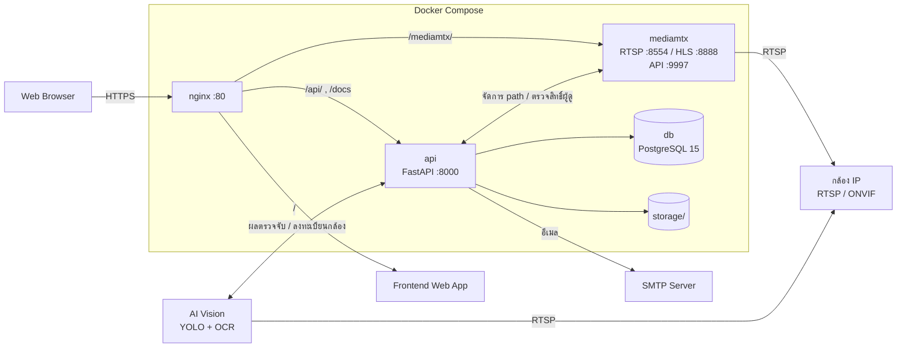

# Village Guard Backend — สถาปัตยกรรมระบบ

เอกสารนี้อธิบายโครงสร้างและการทำงานภายในของ backend สำหรับผู้ดูแลระบบและนักพัฒนาที่รับช่วงต่อ

- วิธีติดตั้ง อัปเดต และดูแลระบบ → [README.md](../README.md)
- คำอธิบายตัวแปรตั้งค่าทุกตัว → [.env.example](../.env.example)
- รายละเอียด request/response ของทุก endpoint → Swagger ที่ `/docs` (หรือ `/openapi.json`)

---

## 1. ภาพรวม

Village Guard Backend คือ API ของระบบรักษาความปลอดภัยหมู่บ้านที่ตรวจจับป้ายทะเบียนรถจากกล้องวงจรปิด ระบบ AI Vision (YOLO + OCR) เป็นผู้อ่านป้าย แล้วส่งผลมาให้ backend บันทึก ตรวจกับ whitelist/blacklist แจ้งเตือนแบบ real-time และให้หน้าเว็บดึงข้อมูล ดูภาพสด และออกรายงาน รองรับหลายหมู่บ้านในระบบเดียว (multi-tenant)

| ส่วน | เทคโนโลยี |
| :--- | :--- |
| ภาษา / Runtime | Python 3.11 (Docker image `python:3.11-slim`) |
| Web framework | FastAPI + Uvicorn |
| ฐานข้อมูล | PostgreSQL 15, SQLAlchemy 2.0 (async, asyncpg), Alembic |
| Authentication | JWT (PyJWT, HS256) + refresh token ใน httpOnly cookie, รหัสผ่าน Argon2 (argon2-cffi) |
| Real-time | Server-Sent Events (sse-starlette) |
| ภาพสดจากกล้อง | MediaMTX (รับ RTSP จากกล้อง ส่งออกเป็น HLS) + token ES256 (cryptography) |
| อีเมล | aiosmtplib (STARTTLS) |
| รูปภาพ | Pillow (ตรวจว่าเป็นรูปจริง), เก็บบนดิสก์ใน `storage/` |
| HTTP client | httpx (เรียก MediaMTX API และ AI Vision) |
| ค้นหากล้อง | onvif_zeep (ONVIF) |
| Deployment | Docker Compose (`db`, `api`, `mediamtx`, `nginx`) + GitHub Actions self-hosted runner, api รันจากโค้ดที่ build ไว้ใน image |

---

## 2. สถาปัตยกรรม



| จาก → ไป | ช่องทาง | ใช้ทำอะไร |
| :--- | :--- | :--- |
| Browser → nginx | nginx ฟังพอร์ต 80 ส่วน HTTPS ถูกจัดการโดย proxy ที่อยู่หน้า nginx | ทางเข้าเดียวของผู้ใช้ |
| nginx → Frontend | `/` → `192.168.100.97:3000` | หน้าเว็บ (รันแยกจาก compose นี้) |
| nginx → AI Vision | `/smartlpr/` → `192.168.100.97:8081` | เข้าถึง AI Vision ผ่านโดเมนเดียวกัน |
| nginx → api | `/api/`, `/api/sse/`, `/docs`, `/openapi.json` | REST API, SSE (ปิด buffering, timeout 24 ชม.), Swagger |
| nginx → mediamtx | `/mediamtx/` → `mediamtx:8888` | ดูภาพสดแบบ HLS |
| AI Vision → api | `POST /api/detections` | ส่งผลการอ่านป้าย + รูป |
| api → AI Vision | `{AI_VISION_API_URL}/partner/cameras` | ลงทะเบียนกล้อง ส่ง webhook URL ให้ เปิด/ปิด/ลบกล้อง เช็คผลยืนยันกล้อง |
| api → mediamtx | `{MEDIAMTX_API_URL}/v3/...` ผ่าน network ภายในของ docker | สร้าง/ลบ path ของกล้อง เช็คว่ากล้องออนไลน์ เช็คว่า MediaMTX ยังทำงาน (MediaMTX ไม่ตรวจรหัสสำหรับ API เพราะ `authHTTPExclude: api` ความปลอดภัยจึงมาจากการเปิดพอร์ต 9997 เฉพาะ `127.0.0.1` บน VM) |
| mediamtx → api | `POST http://api:8000/api/mediamtx/webhook` | ถาม api ว่าคนนี้มีสิทธิ์ดูกล้องนี้ไหม (`authMethod: http`) |
| mediamtx / AI Vision → กล้อง | RTSP (TCP) | ทั้งสองฝั่งดึงภาพจากกล้องเองโดยตรง |

---

## 3. โครงสร้างโฟลเดอร์

```text
YOLO_VM/
├── .github/workflows/deploy.yml   # push เข้า main → deploy บน VM ผ่าน self-hosted runner
├── alembic/
│   ├── env.py                     # รัน migration แบบ async โดยอ่าน DATABASE_URL จาก config
│   ├── script.py.mako
│   └── versions/                  # ไฟล์ migration (ชื่อไฟล์ขึ้นต้นด้วยวันที่)
├── alembic.ini
├── app/
│   ├── main.py                    # สร้าง app, middleware (CORS, จำกัดขนาด request, rate limit), lifespan
│   ├── api/
│   │   ├── deps.py                # ตรวจ JWT + session, require_roles, verify_api_key, rate limit ตาม IP
│   │   ├── router.py              # รวมทุก router ไว้ใต้ /api
│   │   └── endpoints/             # auth, users, villages, camera, detection, whitelist, blacklist,
│   │                              # contacts, notifications, reports, audit_logs, sse, mediamtx
│   ├── core/
│   │   ├── config.py              # Settings (pydantic-settings) อ่านค่าจาก .env
│   │   ├── security.py            # Argon2, JWT access token, SHA-256 ของ token, นโยบายรหัสผ่าน
│   │   ├── session_manager.py     # session ที่ใช้งานอยู่ + จำกัดจำนวน session + ประวัติ rotation (in-memory)
│   │   ├── account_lockout.py     # ล็อกบัญชีเมื่อใส่รหัสผิดซ้ำ (in-memory)
│   │   ├── rate_limit.py          # rate limiter (in-memory)
│   │   ├── alert_cooldown.py      # กันแจ้งเตือนซ้ำถี่ (in-memory)
│   │   ├── sse_channel.py         # pub/sub ของ SSE + ticket ใช้ครั้งเดียว
│   │   ├── stream_registry.py     # ทะเบียน SSE stream ที่เปิดอยู่ ใช้สั่งปิดเมื่อ session ถูกยกเลิก
│   │   ├── background.py          # ติดตาม asyncio task เบื้องหลัง และยกเลิกตอนปิดระบบ
│   │   ├── scope_utils.py         # กรองข้อมูลตามหมู่บ้านของผู้ใช้ (multi-tenant)
│   │   ├── plate_format.py        # ตรวจ/normalize ป้ายทะเบียนและจังหวัด
│   │   ├── contact_format.py      # ตรวจรูปแบบช่องทางติดต่อ
│   │   ├── regex_patterns.py      # regex ที่ใช้ร่วมกัน
│   │   ├── url_utils.py           # normalize / ซ่อนรหัสใน RTSP URL, เช็คว่า RTSP ตอบสนอง
│   │   ├── request_utils.py       # หา IP จริงของ client (อ่าน X-Forwarded-For ตามจำนวน proxy)
│   │   ├── db_utils.py            # escape ค่าสำหรับ LIKE
│   │   ├── timezone.py            # Asia/Bangkok
│   │   ├── error_messages.py      # ข้อความ error กลาง
│   │   └── exceptions.py          # exception handler กลาง
│   ├── db/
│   │   ├── base.py                # รวม model ทั้งหมดให้ Alembic เห็น
│   │   ├── base_class.py          # Declarative Base
│   │   └── session.py             # async engine (pool 20 + overflow 10) + get_db
│   ├── models/                    # ORM model 11 ตาราง (หัวข้อ 4)
│   ├── schemas/                   # Pydantic schema ของ request / response
│   └── services/                  # business logic (ตารางด้านล่าง)
├── nginx/nginx.conf               # reverse proxy
├── docker-compose.yml             # service: db, api, mediamtx, nginx
├── dockerfile                     # image ของ api (python:3.11-slim, รันด้วย non-root user)
├── mediamtx.yml                   # config MediaMTX (RTSP + HLS, ตรวจสิทธิ์ผ่าน webhook ของ api)
├── create_superadmin.py           # สร้าง superadmin คนแรก
├── pyproject.toml                 # dependencies + config ruff / pytest
├── .env.example                   # ตัวอย่างไฟล์ตั้งค่า
└── storage/                       # สร้างตอนรัน ไม่อยู่ใน git: รูปตรวจจับ + avatar
```

| Service | หน้าที่ |
| :--- | :--- |
| `auth_service` | login, ออก / rotate / ยกเลิก token, ลืมรหัส / ตั้งรหัส / ยืนยันอีเมลใหม่, ลบ token หมดอายุ, คืน session ตอน start |
| `login_security_service` | บันทึกและแจ้งเตือนเมื่อมีการเดารหัส (brute-force) หรือ login ถี่ผิดปกติ |
| `session_validation_service` | ตรวจ SSE stream ที่เปิดอยู่เป็นระยะ ปิดทิ้งถ้าผู้ใช้ถูกปิดบัญชี / เปลี่ยนรหัส / session หมด |
| `user_service` | จัดการผู้ใช้, ส่งคำเชิญ, รีเซ็ตรหัส, ปลดล็อกบัญชี, avatar, เปลี่ยนอีเมล |
| `village_service` | จัดการหมู่บ้าน, เปิด/ปิดหมู่บ้าน (ไล่ปิด/เปิดกล้องตาม), ลบหมู่บ้าน |
| `camera_service` | จัดการกล้อง, sync กับ MediaMTX + AI Vision, resync, เช็คสถานะออนไลน์ |
| `camera_verification_service` | วนถาม AI Vision ว่ากล้องใช้งานได้จริงไหม (pending → verified / failed) |
| `onvif_service` | ค้นหา RTSP URL จากกล้อง ONVIF |
| `mediamtx_service` | เรียก MediaMTX API (สร้าง / ลบ path, เช็คสถานะ), สร้าง URL ดูภาพสด |
| `mediamtx_auth_service` | ออก token ดูกล้อง (ES256) |
| `ai_vision_service` | เรียก API ของ AI Vision (`/partner/cameras`) |
| `detection_service` | รับผลตรวจจับ, ค้นหา, dashboard วันนี้, route tracking, ลบรูปกำพร้า |
| `whitelist_service`, `blacklist_service` | จัดการรายการ + ส่งอีเมลแจ้งเตือนเมื่อพบรถ blacklist |
| `contact_service` | ช่องทางติดต่อของผู้ใช้ + สมุดรายชื่อ |
| `notification_service` | สร้างและอ่านการแจ้งเตือนในระบบ |
| `email_service` | ส่งอีเมล (เชิญ, ตั้งรหัส, ยืนยันอีเมล, แจ้งเตือน blacklist) + จำว่า SMTP ล่มอยู่หรือไม่ |
| `presence_service` | ติดตามว่าใครออนไลน์อยู่ (ผู้ใช้ในหมู่บ้าน / superadmin) แล้วส่งผ่าน SSE |
| `report_service` | รายงานสรุปและรายงานรายวัน |
| `audit_service` | บันทึกและค้นหา audit log |
| `storage_service` | ตรวจและบันทึกรูป, กัน path traversal |
| `channel_service` | ช่อง SSE `alerts` และ `security_alerts` |

---

## 4. ฐานข้อมูล

### 4.1 ER Diagram

```mermaid
erDiagram
    GroupTABLE |o--o{ UserTABLE : "village_id"
    GroupTABLE ||--o{ CameraTABLE : "village_id CASCADE"
    GroupTABLE ||--o{ WhitelistTABLE : "village_id CASCADE"
    GroupTABLE ||--o{ BlacklistTABLE : "village_id CASCADE"
    GroupTABLE |o--o{ CarTABLE : "village_id SET NULL"
    GroupTABLE |o--o{ AuditLogTABLE : "village_id SET NULL"
    GroupTABLE |o--o{ NotificationTABLE : "village_id SET NULL"
    CameraTABLE |o--o{ CarTABLE : "camera_id SET NULL"
    UserTABLE ||--o{ RefreshTABLE : "user_id CASCADE"
    UserTABLE ||--o{ VerifyTABLE : "user_id CASCADE"
    UserTABLE ||--o{ ContactTABLE : "user_id CASCADE"
    UserTABLE ||--o{ NotificationTABLE : "user_id CASCADE"
    UserTABLE |o--o{ WhitelistTABLE : "added_by SET NULL"
    UserTABLE |o--o{ BlacklistTABLE : "added_by SET NULL"
    UserTABLE |o--o{ AuditLogTABLE : "user_id SET NULL"

    GroupTABLE {
        uuid id PK
        string name
        string address "ค่าเริ่มต้น -"
        boolean is_active
        timestamp created_at
    }

    UserTABLE {
        uuid id PK
        string username UK
        string fullname
        string email UK
        string hashpassword "NULL จนกว่าจะตั้งรหัส"
        string avatar_path
        enum role "superadmin, admin, user"
        uuid village_id FK "NULL เฉพาะ superadmin"
        boolean is_active
        boolean is_verify
        timestamp password_changed_at
        timestamp created_at
    }

    CameraTABLE {
        uuid id PK
        uuid village_id FK
        string name "ไม่ซ้ำในหมู่บ้าน"
        float lat
        float long
        string stream_ai UK "RTSP URL"
        enum direction "entry, exit, internal"
        enum verification_status "pending, verified, failed"
        timestamp ai_vision_synced_at
        boolean is_active
        boolean is_online "NULL คือยังไม่เคยเช็ค"
        int delay "ค่าเริ่มต้น 1"
        timestamp created_at
    }

    CarTABLE {
        uuid id PK
        uuid event_id UK "มาจาก AI Vision"
        uuid camera_id FK
        uuid village_id FK
        string village_name "snapshot"
        string camera_name "snapshot"
        float camera_lat "snapshot"
        float camera_long "snapshot"
        string license_plate
        string province
        string color
        string image_crop "path ใน storage"
        string image_full "path ใน storage"
        timestamp time_detect
        boolean is_blacklist
        boolean is_whitelist
        enum direction "คัดลอกจากกล้อง"
        timestamp created_at
    }

    WhitelistTABLE {
        uuid id PK
        uuid village_id FK
        string name
        string house_no
        string phone
        string license_plate
        string province
        string color
        string note
        uuid added_by FK
        timestamp created_at
    }

    BlacklistTABLE {
        uuid id PK
        uuid village_id FK
        string license_plate
        string province
        string reason
        uuid added_by FK
        timestamp created_at
    }

    ContactTABLE {
        uuid id PK
        uuid user_id FK
        enum content_type "phone, line, facebook, instagram, email, other"
        string custom_label
        string value
        timestamp created_at
    }

    NotificationTABLE {
        uuid id PK
        uuid user_id FK
        uuid village_id FK
        string action
        string detail
        jsonb payload
        boolean is_read
        timestamp created_at
    }

    AuditLogTABLE {
        uuid id PK
        uuid village_id FK
        uuid user_id FK
        string actor_username
        string action
        string detail
        string ip_address
        string user_agent
        timestamp created_at
    }

    RefreshTABLE {
        uuid id PK "คือ session_id"
        uuid user_id FK
        string token_hash "SHA-256"
        timestamp expired_at
        boolean remember_me
        timestamp created_at
    }

    VerifyTABLE {
        uuid id PK
        uuid user_id FK
        enum type "INITIAL_SETUP, PASSWORD_RESET, EMAIL_CHANGE"
        string new_email
        string token_hash "SHA-256"
        timestamp expire_at
        boolean used
        timestamp created_at
    }
```



### 4.2 กฎของข้อมูลที่ควรรู้

- **UserTABLE** มี CHECK constraint: superadmin ต้องมี `village_id` เป็น NULL ส่วน admin และ user ต้องมีหมู่บ้านเสมอ, `username` และ `email` ห้ามซ้ำทั้งระบบ
- **CameraTABLE** ห้าม RTSP URL (`stream_ai`) ซ้ำทั้งระบบ และห้ามชื่อกล้องซ้ำในหมู่บ้านเดียวกัน, กล้องใหม่เริ่มที่ `verification_status = pending`
- **CarTABLE** ใช้ `event_id` (unique) กันบันทึกผลซ้ำเมื่อ AI Vision ส่งซ้ำ และเก็บ snapshot ชื่อหมู่บ้าน ชื่อกล้อง และพิกัดไว้ในแถว เพื่อให้ประวัติยังอ่านได้แม้ลบกล้องหรือหมู่บ้านไปแล้ว (FK เป็น `SET NULL`) มี index `(village_id, time_detect)`, `(license_plate, province)` และ GIN trigram บน `license_plate` สำหรับค้นหาป้ายบางส่วน
- **WhitelistTABLE / BlacklistTABLE** ห้ามซ้ำที่ `(village_id, license_plate, province)` และมี GIN trigram บน `license_plate` ส่วน extension `pg_trgm` ถูกสร้างโดย migration อัตโนมัติ
- **ContactTABLE** ผู้ใช้หนึ่งคนมีช่องทางแต่ละประเภทได้ประเภทละ 1 รายการ ยกเว้น `other` (partial unique index)
- **RefreshTABLE** หนึ่งแถวคือหนึ่ง session (`id` = session_id) เก็บเฉพาะ SHA-256 ของ refresh token ไม่เก็บตัว token จริง (คอลัมน์ในฐานข้อมูลชื่อ `expired_at`)
- **VerifyTABLE** เก็บ token ในลิงก์อีเมล (เชิญ, รีเซ็ตรหัส, เปลี่ยนอีเมล) เป็น SHA-256 และใช้ได้ครั้งเดียว (`used`)
- **การลบหมู่บ้าน** (`DELETE /api/villages/{id}?confirm=true`) จะลบกล้อง ผู้ใช้ whitelist และ blacklist ของหมู่บ้านนั้น แต่ประวัติการตรวจจับยังอยู่ (ตัดความเชื่อมโยงแล้วเก็บเป็นสถิติ)

### 4.3 Migration

ไฟล์ migration อยู่ใน `alembic/versions/` ใช้คำสั่ง `alembic upgrade head` เพื่ออัปเดตฐานข้อมูลเป็นเวอร์ชันล่าสุด (วิธีสั่งใน Docker อยู่ใน README) เวลาแก้ model ให้สร้าง migration ใหม่ด้วย `alembic revision --autogenerate -m "คำอธิบาย"` แล้วเปิดตรวจไฟล์ที่ได้ทุกครั้งก่อน commit

---

## 5. บทบาทและสิทธิ์

ทุกข้อมูลผูกกับหมู่บ้าน (`village_id`) admin และ user เห็นและแก้ได้เฉพาะหมู่บ้านของตัวเอง ส่วน superadmin ไม่มีหมู่บ้านและเห็นทุกหมู่บ้าน (เวลาสร้างข้อมูลต้องระบุ `village_id` เอง)

| โมดูล | superadmin | admin | user (รปภ. / เจ้าหน้าที่) |
| :--- | :--- | :--- | :--- |
| หมู่บ้าน | สร้าง / แก้ / เปิดปิด / ลบ | ดูหมู่บ้านตัวเอง | ดูหมู่บ้านตัวเอง |
| ผู้ใช้ | จัดการ admin และ user ทุกหมู่บ้าน | จัดการ user ในหมู่บ้าน (สร้าง, เปิดปิด, รีเซ็ตรหัส, ส่งคำเชิญซ้ำ, ปลดล็อก, ลบ) | แก้โปรไฟล์ / avatar / อีเมลของตัวเอง |
| กล้อง | ดู + จัดการทุกหมู่บ้าน | ดู + จัดการในหมู่บ้าน (เพิ่ม, แก้, ลบ, resync, เช็คการยืนยัน, ONVIF probe) | ดูรายการ สถานะ และภาพสด |
| ผลตรวจจับ, dashboard, route tracking, รายงาน | ทุกหมู่บ้าน | หมู่บ้านตัวเอง | หมู่บ้านตัวเอง |
| Whitelist / Blacklist | ทุกหมู่บ้าน | เพิ่ม / แก้ / ลบ ในหมู่บ้าน | เพิ่ม / แก้ / ลบ ในหมู่บ้าน |
| ช่องทางติดต่อ | ของทุกคน | ของตัวเอง + ของ user ในหมู่บ้าน | ของตัวเอง |
| Audit log | ทุกหมู่บ้าน | หมู่บ้านตัวเอง | ไม่มีสิทธิ์ |
| การแจ้งเตือนในระบบ | ของตัวเอง | ของตัวเอง | ของตัวเอง |
| SSE: alerts + presence | ได้ | ได้ | ได้ |
| SSE: security alerts | ได้ | ได้ | ไม่มีสิทธิ์ |

---

## 6. Flow การทำงานหลัก

### 6.1 รับผลตรวจจับจาก AI Vision

1. AI Vision ยิง `POST /api/detections` แบบ `multipart/form-data` พร้อม header `X-API-Key`
   - ฟิลด์: `event_id` (UUID), `camera_id` (UUID), `license_plate`, `province`, `color`, `capture_time`
   - ไฟล์: `image_crop` (รูปป้าย), `image_full` (รูปเต็ม)
2. ถ้า `event_id` ขึ้นต้นด้วย `TEST_Event_` หรือ `camera_id` ขึ้นต้นด้วย `TEST_Camera_` จะตอบ `200 {"status": "test_ok"}` โดยไม่บันทึกอะไร (ให้ทีม AI ทดสอบการเชื่อมต่อ)
3. จำกัด 200 request ต่อนาทีต่อกล้อง เกินแล้วตอบ `429`
4. ตรวจรูปแบบข้อมูล ผิดตอบ `422` ถ้า `event_id` นี้เคยบันทึกแล้วตอบ `200` พร้อม `event_id` เดิมโดยไม่บันทึกซ้ำ
5. กล้องต้องมีอยู่จริง (ไม่งั้น `404`) และทั้งกล้องและหมู่บ้านต้องเปิดใช้งานอยู่ (ไม่งั้น `409`)
6. ถ้ากล้องยัง `pending` จะถูกเปลี่ยนเป็น `verified` ทันที เพราะผลแรกที่เข้ามาพิสูจน์แล้วว่า AI อ่านกล้องนี้ได้
7. ตรวจว่ารูปเป็นรูปจริงและไม่เกิน 10 MB แล้วบันทึกที่ `storage/{village_id}/{camera_id}/{detection_id}_crop.{ext}` และ `_full.{ext}`
8. เทียบ `(หมู่บ้าน, ป้าย, จังหวัด)` กับ blacklist และ whitelist แบบตรงตัว
9. บันทึกแถวใน CarTABLE (พร้อม snapshot และทิศทางของกล้อง) ถ้าเจอ blacklist จะบันทึก audit log และสร้างการแจ้งเตือนให้ admin และ user ของหมู่บ้าน ถ้าเจอ whitelist จะสร้างการแจ้งเตือนเช่นกัน
10. commit ลงฐานข้อมูล ถ้ามีสอง request ใช้ `event_id` เดียวกันพร้อมกัน ตัวที่แพ้จะได้ `200` และรูปที่เพิ่งเขียนจะถูกลบ
11. ส่ง SSE `detection_created` (และ `blacklist_alert` / `whitelist_alert`) ให้หมู่บ้านนั้นและให้ superadmin แล้วตอบ `201 {"event_id": ...}`
12. หลังตอบแล้ว ถ้าเป็น blacklist จะส่งอีเมลหา admin และ user ของหมู่บ้าน โดยป้ายเดิมจะไม่ส่งซ้ำภายใน 15 นาที (`BLACKLIST_EMAIL_ALERT_COOLDOWN_SECONDS`) และข้ามไปถ้า SMTP กำลังล่ม

### 6.2 วงจรชีวิตของกล้อง

1. admin หรือ superadmin เพิ่มกล้องด้วย `POST /api/cameras` (ชื่อ, พิกัด, RTSP URL, ทิศทาง `entry` / `exit` / `internal`, `delay`) กล้องถูกบันทึกเป็น `pending`
2. งานเบื้องหลัง: สร้าง path ชื่อ `{camera_id}` ใน MediaMTX ให้ดึง RTSP จากกล้องด้วย TCP และส่ง `{camera_id, camera_url, webhook_url, delay}` ไปที่ AI Vision `POST /partner/cameras`
3. ถ้า AI Vision รับแล้ว จะวนถาม `GET /partner/cameras/{id}` ทุก 2 วินาทีนานสุด 60 วินาที จนได้ `verified` หรือ `failed` (หรือ verified ทันทีถ้ามีผลตรวจจับแรกเข้ามาก่อน) ถ้าหมดเวลาจะเป็น `failed` สั่ง AI Vision ปิดกล้อง และส่ง SSE `camera_verification_timeout`
4. ผลการยืนยันถูกส่งผ่าน SSE (`camera_verified` / `camera_verification_failed`) ถ้า sync กับ MediaMTX หรือ AI Vision ไม่สำเร็จ จะสร้างการแจ้งเตือนและส่ง SSE `camera_sync_failed`
5. สั่งเช็คการยืนยันซ้ำเองได้ที่ `POST /api/cameras/{id}/verification-check` (ได้ 1 ครั้งต่อ 30 วินาที)
6. แก้กล้อง: เปิด/ปิดกล้องจะ sync ไปที่ AI Vision และ MediaMTX (ปิด = ลบ path), แก้ `delay` จะส่งไป AI Vision ส่วน RTSP URL แก้ไม่ได้ ต้องลบแล้วเพิ่มใหม่
7. ลบกล้อง: ลบ path ใน MediaMTX และลบกล้องใน AI Vision ประวัติการตรวจจับยังอยู่
8. ปิดหมู่บ้าน: ไล่ปิดกล้องทั้งหมดของหมู่บ้าน, เปิดหมู่บ้านคืน: ไล่เปิดกล้องคืน
9. ทุก 10 วินาที ระบบจะ:
   - เช็คว่า MediaMTX ยังทำงาน ถ้าล่มติดกัน 3 รอบจะแจ้งเตือนทุกหมู่บ้านและ superadmin (`streaming_server_down`) และแจ้งอีกครั้งเมื่อกลับมาครบ 2 รอบ (`streaming_server_recovered`)
   - ลงทะเบียน path ของกล้องที่เปิดอยู่ทั้งหมดซ้ำใน MediaMTX (กันกรณี MediaMTX restart)
   - อ่านสถานะกล้องแต่ละตัวแล้วอัปเดต `is_online` โดยต้อง offline ติดกัน 3 รอบ (~30 วินาที) หรือ online ติดกัน 2 รอบ (~20 วินาที) ก่อนจะแจ้งเตือน + บันทึก audit + ส่ง SSE `camera_offline` / `camera_online` / `camera_status_changed`
10. ถ้าไม่รู้ RTSP URL ของกล้อง ใช้ `POST /api/cameras/onvif/probe` ช่วยค้นหาจากกล้องที่รองรับ ONVIF

### 6.3 ดูภาพสด

1. หน้าเว็บขอ `GET /api/cameras/{camera_id}/stream-token` (ทุก role ภายในหมู่บ้านตัวเอง กล้องต้องเปิดอยู่)
2. api เซ็น JWT แบบ ES256 ด้วย `MEDIAMTX_JWT_PRIVATE_KEY_B64` ใส่ `user_id` และสิทธิ์ `read` เฉพาะ path ของกล้องนั้น อายุตาม `MEDIAMTX_STREAM_TOKEN_EXPIRE_SECONDS` แล้วตอบกลับเป็น `stream_url = /mediamtx/{camera_id}/index.m3u8?jwt=...` พร้อม `expires_at`
3. เบราว์เซอร์เล่น HLS ผ่าน nginx `/mediamtx/` → `mediamtx:8888`
4. MediaMTX ถาม api ทุกครั้งผ่าน `POST /api/mediamtx/webhook` api ตรวจลายเซ็นและวันหมดอายุของ token, ผู้ใช้ยังเปิดใช้งาน, กล้องยังเปิดอยู่ และผู้ใช้ยังมีสิทธิ์ในหมู่บ้านของกล้อง ผ่านตอบ `200` ไม่ผ่านตอบ `401` ผลที่ผ่านจะ cache ไว้ 10 วินาทีต่อคู่ (path, token)
5. ถ้า MediaMTX ส่ง action อื่นที่ไม่ใช่ `read` มา (เช่น `publish`) api จะตอบ `403` ทันที ระบบจึงมีแต่ภาพที่ MediaMTX ดึงจากกล้องเอง ไม่มีใครส่งภาพเข้ามาได้

### 6.4 Login และ session

1. `POST /api/auth/login` (form: `username`, `password`, `remember_me`)
2. ผ่านแล้วได้ access token (JWT HS256 อายุ `ACCESS_TOKEN_EXPIRE_MINUTES` มี `sub` = user_id และ `sid` = session_id) ใน body และ refresh token ใน cookie `refresh_token` (httpOnly, path `/api/auth`)
3. refresh token อายุ `REFRESH_TOKEN_EXPIRE_DAYS` วันถ้าติ๊กจดจำ ไม่งั้น `REFRESH_TOKEN_SESSION_EXPIRE_HOURS` ชั่วโมง
4. ผู้ใช้หนึ่งคนมีได้สูงสุด 5 session (`AUTH_MAX_SESSIONS_PER_USER`) เกินแล้ว session เก่าสุดจะถูกเตะออก (และ SSE ของ session นั้นถูกปิด)
5. `POST /api/auth/refresh` ออก refresh token ใหม่ทุกครั้ง (rotation) ถ้า token เก่าถูกใช้ซ้ำภายใน 30 วินาที (เช่นหลายแท็บพร้อมกัน) จะได้ access token ใหม่ แต่ถ้าใช้ซ้ำหลังจากนั้นจะถือว่าถูกขโมย ระบบยกเลิก session ทันทีและบันทึก `refresh_token_reuse_detected`
6. ทุก request ที่ต้อง login จะตรวจ: JWT ถูกต้อง, session ยังอยู่, ผู้ใช้ยังเปิดใช้งานและยืนยันแล้ว, หมู่บ้านยังเปิดอยู่ และ token ออกหลังการเปลี่ยนรหัสผ่านครั้งล่าสุด (เปลี่ยนรหัส = ออกจากระบบทุกเครื่อง)
7. ใส่รหัสผิด 5 ครั้งจะถูกล็อก 5 วินาที และผิดต่อครั้งละ +5 วินาที ระบบบันทึกและส่ง security alert ไปหา admin และ superadmin, admin ปลดล็อกได้ที่ `POST /api/users/{id}/unlock-account`, login สำเร็จถี่เกิน 5 ครั้งใน 60 วินาทีจะส่ง alert `rapid_login_detected`
8. ผู้ใช้ใหม่ที่ admin สร้างจะได้อีเมลเชิญพร้อมลิงก์ `{FRONTEND_URL}/set-password?token=...` เพื่อตั้งรหัสเอง ลิงก์รีเซ็ตรหัสใช้หน้าเดียวกัน ส่วนเปลี่ยนอีเมลใช้ `{FRONTEND_URL}/confirm-email-change?token=...`
9. นโยบายรหัสผ่าน: 8–36 ตัวอักษร ต้องมีตัวอักษรอังกฤษ ตัวเลข และสัญลักษณ์

### 6.5 Real-time (SSE)

1. หน้าเว็บขอ ticket ก่อน (ใช้ได้ครั้งเดียว อายุ `SSE_TICKET_EXPIRE_SECONDS`) เพราะ EventSource ส่ง header Authorization ไม่ได้
   - `POST /api/sse/ticket` — ช่อง alerts (ทุก role)
   - `POST /api/sse/security-alerts/ticket` — ช่อง security (admin, superadmin)
   - `POST /api/sse/presence/ticket` — ช่อง presence (ทุก role)
2. เปิด stream เดียวที่ `GET /api/sse/stream?alerts_ticket=...&security_ticket=...&presence_ticket=...` (ticket ทุกใบต้องมาจาก session เดียวกัน)
3. ระบบส่ง `padding` ตอนเปิด และ `ping` ทุก 15 วินาที
4. หนึ่ง session เปิดได้สูงสุด 5 stream (`SSE_MAX_STREAMS_PER_SESSION`) และทุก 30 วินาทีระบบจะปิด stream ของ session ที่ไม่ valid แล้วด้วย event `force_close`

| ช่อง | Event |
| :--- | :--- |
| alerts | `detection_created`, `blacklist_alert`, `whitelist_alert`, `camera_status_changed`, `camera_online`, `camera_offline`, `camera_verified`, `camera_verification_failed`, `camera_verification_timeout`, `camera_sync_failed`, `streaming_server_down`, `streaming_server_recovered` |
| security_alerts | `login_bruteforce_detected`, `rapid_login_detected` |
| presence | `presence_update` (รายชื่อผู้ใช้ที่ออนไลน์) |

superadmin รับ event ของทุกหมู่บ้านผ่านช่อง global ซึ่ง payload จะมี `village_id` เพิ่มมาด้วย ส่วน `GET /api/sse/test` เป็น stream ทดสอบที่ไม่ต้อง login ใช้เช็คว่า proxy ไม่ buffer SSE

---

## 7. ตอน start และงานเบื้องหลัง

| งาน | ความถี่ | ทำอะไร |
| :--- | :--- | :--- |
| คืน session | ตอน start | โหลด session ที่ยังไม่หมดอายุจาก RefreshTABLE กลับเข้า memory ผู้ใช้ไม่ต้อง login ใหม่หลัง restart |
| Camera resync | ตอน start (พยายามสูงสุด 3 ครั้ง) | ลงทะเบียน path ของกล้องที่เปิดอยู่ทั้งหมดใน MediaMTX ถ้าล้มเหลวทั้ง 3 ครั้ง ให้สั่ง `POST /api/cameras/resync-all` เอง |
| ทำ verification ที่ค้างต่อ | ตอน start | กล้องที่ยัง `pending` เริ่มวนถาม AI Vision ต่อ |
| ลบ refresh token หมดอายุ | ทุก 1 ชั่วโมง | ลบแถวที่หมดอายุใน RefreshTABLE |
| เช็คสถานะกล้อง | ทุก 10 วินาที | ตามข้อ 6.2 ข้อ 9 |
| ลบรูปกำพร้า | ทุก 24 ชั่วโมง | ลบไฟล์รูปที่ไม่มีแถวใน CarTABLE และค้างเกิน 1 ชั่วโมง (ไม่แตะโฟลเดอร์ avatars) |
| Presence broadcaster | ต่อเนื่อง | รวมการเปลี่ยนแปลงว่าใครออนไลน์ แล้วส่งผ่าน SSE |
| SSE revalidation | ทุก `SSE_REVALIDATION_INTERVAL_SECONDS` (30 วินาที) | ปิด stream ของ session ที่ไม่ valid แล้ว |

ถ้างานแบบวนรอบเกิด error จะเว้นช่วงก่อนลองใหม่ เริ่มที่ 10 วินาทีแล้วเพิ่มเป็นสองเท่าทุกครั้ง สูงสุด 1 ชั่วโมง

---

## 8. ข้อจำกัดเชิงออกแบบ: ต้องรันเป็น process เดียว

state หลายส่วนเก็บอยู่ใน memory ของ process: session ที่ใช้งานอยู่, rate limit, การล็อกบัญชี, cooldown ของการแจ้งเตือน, ticket และ subscriber ของ SSE, presence และ cache ของ MediaMTX webhook ผลที่ตามมาคือ

- **api ต้องรันแบบ 1 process 1 container** ห้ามเพิ่ม `--workers` หรือเพิ่ม replica ไม่งั้น SSE จะส่งไม่ถึงบางคน และ rate limit / lockout จะนับแยกกันในแต่ละ process
- **เมื่อ restart api** การล็อกบัญชีและ rate limit จะถูกล้าง, SSE ทุกเส้นหลุด (หน้าเว็บต้องเชื่อมต่อใหม่), ส่วน session ยังอยู่เพราะโหลดคืนจากฐานข้อมูล
- ถ้าต้องการขยายเป็นหลาย process ในอนาคต ต้องย้าย state เหล่านี้ไปไว้ที่ store กลาง เช่น Redis

---

## 9. สรุปมาตรการความปลอดภัย

- รหัสผ่านเก็บแบบ Argon2, token ในลิงก์อีเมลและ refresh token เก็บเป็น SHA-256 เท่านั้น
- Access token อายุสั้น, refresh token อยู่ใน httpOnly cookie มี rotation และตรวจจับการใช้ซ้ำ
- จำกัด session ต่อผู้ใช้, เปลี่ยนรหัสแล้ว token เก่าใช้ไม่ได้ทันที
- ล็อกบัญชีเมื่อเดารหัส + แจ้งเตือน admin แบบ real-time
- Rate limit: ทั้งระบบ 200 request ต่อนาทีต่อ IP (ยกเว้น `/health`, `/api/sse`, `POST /api/detections`) และจำกัดเพิ่มเฉพาะ endpoint เช่น login 10 ครั้งต่อนาทีต่อ IP, เปลี่ยนรหัส 5 ครั้งต่อชั่วโมง
- จำกัดขนาด request 10 MB, รูปที่อัปโหลดต้องผ่านการตรวจด้วย Pillow, path ของไฟล์ถูกตรวจกัน path traversal
- ตรวจสิทธิ์ตามหมู่บ้านทุก request (multi-tenant)
- Webhook จาก AI Vision ตรวจ `X-API-Key` แบบ constant-time ผิดเกิน 3 ครั้งใน 5 นาทีต่อ IP จะโดน `429` และทุกครั้งที่ผิดถูกบันทึก audit `api_key_rejected`
- ภาพสดใช้ token ES256 อายุสั้น และตรวจสิทธิ์ของผู้ใช้กับกล้องซ้ำทุกครั้งผ่าน webhook
- MediaMTX รับเฉพาะการดูภาพ ปฏิเสธการส่งภาพเข้า (publish) ทุกกรณี
- พอร์ตฐานข้อมูล (5432) และ MediaMTX API (9997) เปิดเฉพาะบนเครื่อง VM (`127.0.0.1`)
- RTSP URL ที่มีรหัสผ่านกล้องถูกซ่อนในทุก response ของ API
- ทุกการกระทำสำคัญบันทึกใน audit log
- nginx ปิดการแสดงเวอร์ชันและใส่ security header, container ของ api รันด้วย non-root user

---

## 10. การเติบโตของข้อมูล

ระบบไม่ลบข้อมูลต่อไปนี้อัตโนมัติ ควรวางแผนพื้นที่ดิสก์และการเก็บถาวร

| ข้อมูล | อยู่ที่ | หมายเหตุ |
| :--- | :--- | :--- |
| ผลตรวจจับ | CarTABLE | 1 แถวต่อ 1 ครั้งที่อ่านป้ายได้ |
| รูปตรวจจับ | `storage/{village_id}/{camera_id}/` | 2 ไฟล์ต่อ 1 ผลตรวจจับ ไฟล์ละไม่เกิน 10 MB ลบเฉพาะรูปกำพร้า |
| การแจ้งเตือน | NotificationTABLE | 1 แถวต่อผู้รับ 1 คน |
| Audit log | AuditLogTABLE | ทุกการกระทำสำคัญ |
